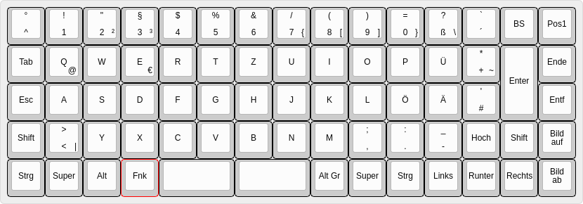
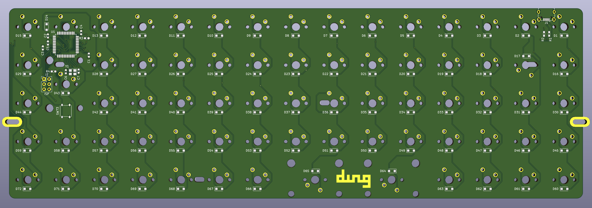
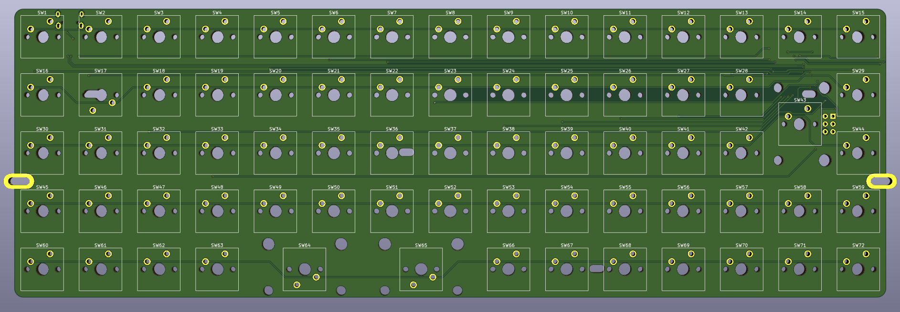

dwzg72
======
A simple ATmega32U4 based 72 key ortholinear keyboard made with KiCAD.
Should fit in a 60% keyboard case.

All keys are 1u ortholinear except for:

* split 2u spacebar
* vertical 2u enter key

My personal layout:

